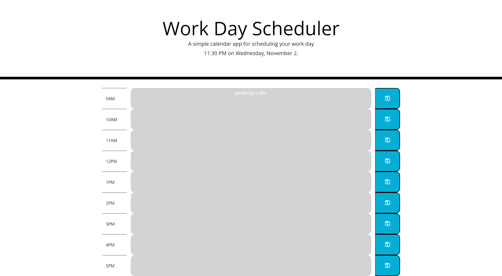

# Project 5 Scheduler

## Scheduler Application
This application works as a daily scheduler and utilizes local storage save features in order to store your tasks. As a computer programmer your daily tasks can become 
clustered and hectic; This scheduler allows you to record those tasks and dynamically color codes each hourly row to aid the user in distinguishing between past, present and future.
Setting up you 9am-5pm work day has never been easier! 

## Usage

- Write down hourly tasks
- Save your tasks to local storage by clicking the save button
- Color codes:
    - Past: Gray
    - Present: Red
    - Future: Green
- Time and Date displayed dynamically

## License 
MIT

## Links
[Github Repo](https://github.com/jon-dev092/Schedule-App)                     
[Deployed Page]()
